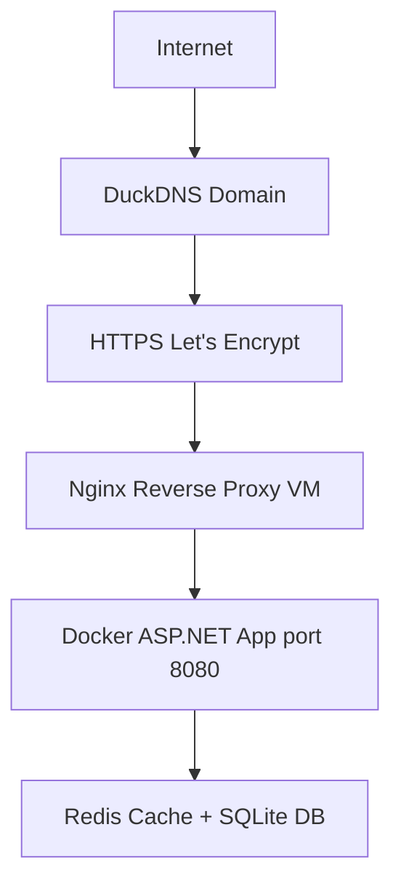

# Money Tracker

A full-stack personal finance tracking web application built with **ASP.NET Core (.NET 8)**, **MVC**, **Docker**, and deployed on a **Google Cloud VM** with **HTTPS**.

**Live Demo:** [https://moneytrackerfinances.duckdns.org](https://moneytrackerfinances.duckdns.org)

## Demo Video
Watch the full application demo:

[](https://youtu.be/NUys3qv_GSc)

## Features
- Add, edit and delete transactions
- Income and expense tracking
- Categories system
- Dashboard with summaries and charts
- Filtering, sorting and search
- Responsive UI (Bootstrap)
- Authentication system (session-based / cookie auth)
- Redis caching for performance
- Dockerized architecture
- Progressive Web App (PWA) support
- Production deployment with HTTPS

## Tech Stack & Production Infrastructure
- **Framework:** ASP.NET Core 8 (MVC)
- **Frontend:** Razor Views + Bootstrap
- **ORM:** Entity Framework Core
- **Database:** SQLite (production)
- **Cache:** Redis Distributed Cache
- **Containerization:** Docker & Docker Compose
- **Reverse Proxy:** Nginx
- **SSL Certificates:** Certbot / Let’s Encrypt
- **Infrastructure:** Google Cloud Compute Engine VPS
- **Domain Provider:** DuckDNS
- **Deployment Environment:** Linux (Ubuntu Server)

## Project Structure
- **Controllers/**: MVC controllers
- **Models/**: Domain models (Transaction, User, Category)
- **DTOs/**: Data transfer objects
- **Services/**: Business logic layer
- **Views/**: Razor UI (Dashboard, Auth, Transactions)
- **Data/**: DbContext (Entity Framework)
- **wwwroot/**: Static files (CSS, JS, icons)
- **Migrations/**: EF Core migrations
- **docker-compose.yml**: Multi-container setup

> See `PROJECT_STRUCTURE.md` for a detailed structure.

## Demo Access
To explore the application's features without creating a new account, you can use the following pre-configured credentials:

* **Username:** `admin`
* **Password:** `admin`

> **Note:** These credentials can be used both on the [https://moneytrackerfinances.duckdns.org](https://moneytrackerfinances.duckdns.org) and when running the project locally via Docker.

## Run Locally (Docker)
1. **Clone repository:**
   ```bash
   git clone https://github.com/Rickiard/MoneyTracker.git
   cd MoneyTracker/MoneyTracker
   ```
2. **Start containers:**
   ```bash
   docker-compose up --build
   ```
3. **Access application:**
   - **Web App:** [http://localhost:8080](http://localhost:8080)
   - **Redis:** `localhost:6379`
   - (Optional DB container depending on config)

## Production Deployment Guide (Google Cloud VM)

This application is deployed on a Linux Virtual Machine hosted on **Google Cloud Platform (GCP)**.

### 1. Google Cloud VM Setup

#### Create the Virtual Machine
1. Open the [Google Cloud Console](https://console.cloud.google.com/).
2. Navigate to: `Compute Engine` → `VM Instances`.
3. Click `Create Instance`.

#### VM Configuration
*   **Name:** `moneytracker-vm`
*   **Region:** Choose the closest region to your users.
*   **Machine Type:** `e2-micro` (Free Tier eligible).
*   **Boot Disk:**
    *   **OS:** `Ubuntu`
    *   **Version:** `Ubuntu 24.04 LTS`
*   **Firewall:**
    *   Allow HTTP traffic
    *   Allow HTTPS traffic

#### Reserve a Static External IP
To prevent the VPS IP from changing after restarting the VM:
1. Go to: `VPC Network` → `IP Addresses`.
2. Locate the VM external IP.
3. Click `Reserve Static Address`.
4. Assign a name and save.

#### Connect to the VPS
Connect through SSH using:
```bash
ssh username@YOUR_EXTERNAL_IP
```
Or use the built-in Google Cloud SSH terminal.

---

### 2. Docker Installation

Update the system:
```bash
sudo apt update && sudo apt upgrade -y
```

Install Docker and Docker Compose:
```bash
sudo apt install docker.io docker-compose -y
```

Enable Docker at startup:
```bash
sudo systemctl enable docker
sudo systemctl start docker
```

Verify installation:
```bash
docker --version
docker-compose --version
```

---

### 3. Clone & Run the Application

Install Git:
```bash
sudo apt install git -y
```

Clone the project:
```bash
git clone https://github.com/Rickiard/MoneyTracker.git
cd MoneyTracker/MoneyTracker
```

Build and start the containers:
```bash
docker-compose up --build -d
```

---

### 4. DuckDNS Configuration

1. Create a free domain at [DuckDNS](https://www.duckdns.org) (e.g., `moneytrackerfinances.duckdns.org`).
2. Point the domain to your VM's external IP.
3. Verify with: `ping your-domain.duckdns.org`.

---

### 5. Nginx Reverse Proxy Setup

Install Nginx:
```bash
sudo apt install nginx -y
```

Create a configuration file: `sudo nano /etc/nginx/sites-available/moneytracker`
```nginx
server {
    listen 80;
    server_name moneytrackerfinances.duckdns.org;

    location / {
        proxy_pass http://localhost:8080;
        proxy_http_version 1.1;
        proxy_set_header Upgrade $http_upgrade;
        proxy_set_header Connection keep-alive;
        proxy_set_header Host $host;
        proxy_cache_bypass $http_upgrade;
    }
}
```

Enable the configuration and restart Nginx:
```bash
sudo ln -s /etc/nginx/sites-available/moneytracker /etc/nginx/sites-enabled/
sudo nginx -t
sudo systemctl restart nginx
```

---

### 6. HTTPS with Let's Encrypt & Certbot

Install Certbot:
```bash
sudo apt install certbot python3-certbot-nginx -y
```

Generate SSL certificates:
```bash
sudo certbot --nginx -d moneytrackerfinances.duckdns.org
```

---

### 7. Firewall Configuration (UFW)

```bash
sudo ufw allow 22
sudo ufw allow 80
sudo ufw allow 443
sudo ufw enable
sudo ufw status
```

---

### 8. Container Management

```bash
# Restart all containers
docker-compose restart

# Stop containers
docker-compose down

# Start containers
docker-compose up -d
```

## Final Architecture


## PWA Support
The application supports **Progressive Web App (PWA)**:
- Installable on mobile devices
- Offline caching support
- Fast startup experience
- Works like a native app
- **Requires HTTPS** (already configured in production)

## CI/CD (GitHub Actions)
Automated pipeline:
1. Build project
2. Run tests
3. Build Docker image
4. Deploy via SSH to VM
5. Restart containers automatically

## Notes
- **SQLite** is used in production due to cloud limitations.
- **Redis** is used for caching dashboard and summary data.
- **Cache invalidation** implemented after CRUD operations.
- **HTTPS** mandatory for PWA features.

## Live URL
[https://moneytrackerfinances.duckdns.org](https://moneytrackerfinances.duckdns.org)

## Credits
**Developed by:** Ricardo Teixeira