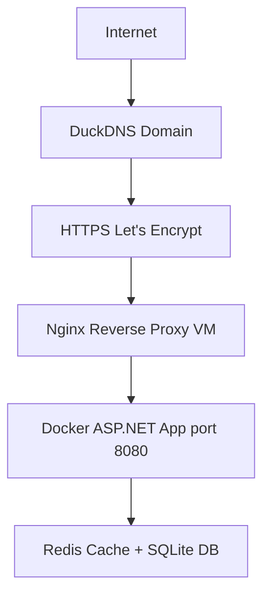

# Money Tracker

A full-stack personal finance tracking web application built with **ASP.NET Core (.NET 8)**, **MVC**, **Docker**, and deployed on a **Google Cloud VM** with **HTTPS**.

**Live Demo:** [https://moneytrackerfinances.duckdns.org](https://moneytrackerfinances.duckdns.org)

## Features
- Add, edit and delete transactions
- Income and expense tracking
- Categories system
- Dashboard with summaries and charts
- Filtering, sorting and search
- Responsive UI (Bootstrap)
- Authentication system (session-based / cookie auth)
- Redis caching for performance
- Dockerized architecture
- Progressive Web App (PWA) support
- Production deployment with HTTPS

## Tech Stack
- **ASP.NET Core 8 (MVC)**
- **Entity Framework Core** (SQLite in production)
- **Redis** (distributed cache)
- **Docker & Docker Compose**
- **Nginx** (reverse proxy)
- **Certbot / Let’s Encrypt** (SSL)
- **Cloud VM** (Google Cloud Compute Engine)
- **DuckDNS** (free domain)

## Project Structure
- **Controllers/**: MVC controllers
- **Models/**: Domain models (Transaction, User, Category)
- **DTOs/**: Data transfer objects
- **Services/**: Business logic layer
- **Views/**: Razor UI (Dashboard, Auth, Transactions)
- **Data/**: DbContext (Entity Framework)
- **wwwroot/**: Static files (CSS, JS, icons)
- **Migrations/**: EF Core migrations
- **docker-compose.yml**: Multi-container setup

> See `PROJECT_STRUCTURE.md` for a detailed structure.

## Demo Access
To explore the application's features without creating a new account, you can use the following pre-configured credentials:

* **Username:** `admin`
* **Password:** `admin`

> **Note:** These credentials can be used both on the [https://moneytrackerfinances.duckdns.org](https://moneytrackerfinances.duckdns.org) and when running the project locally via Docker.

## Run Locally (Docker)
1. **Clone repository:**
   ```bash
   git clone https://github.com/Rickiard/MoneyTracker.git
   cd MoneyTracker/MoneyTracker
   ```
2. **Start containers:**
   ```bash
   docker-compose up --build
   ```
3. **Access application:**
   - **Web App:** [http://localhost:8080](http://localhost:8080)
   - **Redis:** `localhost:6379`
   - (Optional DB container depending on config)

## Production Deployment (Google Cloud VM)
This project is deployed on a **Google Cloud Compute Engine VM** (Ubuntu 24.04).

### 1. VM Setup
- Ubuntu 24.04 LTS
- Open firewall ports: `80` (HTTP), `443` (HTTPS), `8080` (app via Docker)

### 2. Install dependencies
```bash
sudo apt update
sudo apt install docker.io docker-compose nginx certbot python3-certbot-nginx -y
```

### 3. Clone project on VM
```bash
git clone https://github.com/Rickiard/MoneyTracker.git
cd MoneyTracker/MoneyTracker
```

### 4. Run application (Docker)
```bash
docker-compose up -d --build
```
App runs internally on: `http://localhost:8080`

## DuckDNS (Free Domain)
This project uses **DuckDNS** free subdomain: [moneytrackerfinances.duckdns.org](https://moneytrackerfinances.duckdns.org)

**Steps:**
1. Create subdomain
2. Point to VM public IP
3. Ensure DNS propagation

## Nginx Reverse Proxy
Nginx forwards traffic from domain → Docker app.

**Config file:** `/etc/nginx/sites-available/moneytracker`

**Example:**
```nginx
server {
    listen 80;
    server_name moneytrackerfinances.duckdns.org;

    location / {
        proxy_pass http://localhost:8080;
        proxy_set_header Host $host;
        proxy_set_header X-Forwarded-For $proxy_add_x_forwarded_for;
    }
}
```

**Enable:**
```bash
sudo ln -s /etc/nginx/sites-available/moneytracker /etc/nginx/sites-enabled/
sudo nginx -t
sudo systemctl restart nginx
```

## HTTPS Setup (Let’s Encrypt / Certbot)
Free SSL certificate using **Let’s Encrypt** (issuer):
```bash
sudo certbot --nginx -d moneytrackerfinances.duckdns.org
```

**Auto-renew:**
```bash
sudo certbot renew --dry-run
```

## Final Architecture


## PWA Support
The application supports **Progressive Web App (PWA)**:
- Installable on mobile devices
- Offline caching support
- Fast startup experience
- Works like a native app
- **Requires HTTPS** (already configured in production)

## CI/CD (GitHub Actions)
Automated pipeline:
1. Build project
2. Run tests
3. Build Docker image
4. Deploy via SSH to VM
5. Restart containers automatically

## Notes
- **SQLite** is used in production due to cloud limitations.
- **Redis** is used for caching dashboard and summary data.
- **Cache invalidation** implemented after CRUD operations.
- **HTTPS** mandatory for PWA features.

## Live URL
[https://moneytrackerfinances.duckdns.org](https://moneytrackerfinances.duckdns.org)

## Demo Video
Watch the full application demo: